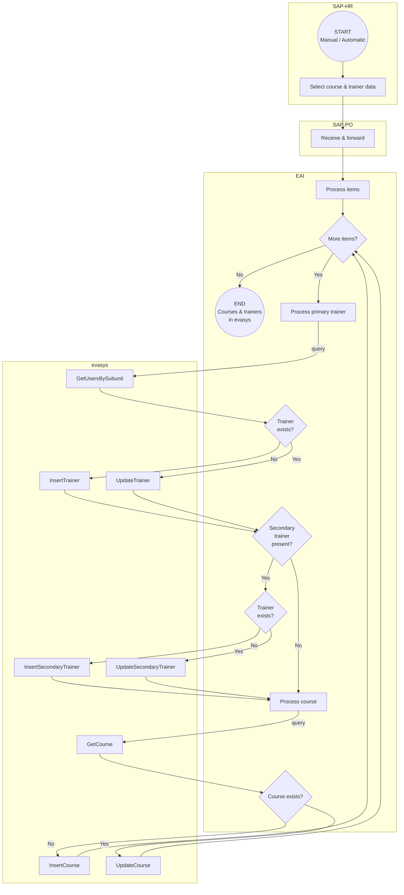

<!-- General project links -->
[open-issues]: https://github.com/it-at-m/refarch-templates/issues
[new-issue]: https://github.com/it-at-m/refarch-templates/issues/new/choose
[milestones]: https://github.com/it-at-m/refarch-templates/milestones
[project-board]: https://github.com/orgs/it-at-m/projects/16
[documentation]: https://refarch.oss.muenchen.de/templates
[contribution-documentation]: https://refarch.oss.muenchen.de/contribute
[itm-opensource]: https://opensource.muenchen.de/
[license]: ../LICENSE
[code-of-conduct]: ./CODE_OF_CONDUCT.md

<!-- Project specific links -->
[refarch-documentation]: https://refarch.oss.muenchen.de/
[refarch-code]: https://github.com/it-at-m/refarch
[spring-documentation]: https://spring.io/ 
[vuejs-documentation]:  https://vuejs.org/
[getting-started-documentation]: https://refarch.oss.muenchen.de/templates/getting-started
[develop-documentation]: https://refarch.oss.muenchen.de/templates/develop
[document-documentation]: https://refarch.oss.muenchen.de/templates/document
[organize-documentation]: https://refarch.oss.muenchen.de/templates/organize

<!-- Shields.io links -->
[documentation-shield]: https://img.shields.io/badge/documentation-blue?style=for-the-badge
[new-issue-shield]: https://img.shields.io/badge/new%20issue-blue?style=for-the-badge
[made-with-love-shield]: https://img.shields.io/badge/made%20with%20%E2%9D%A4%20by-it%40M-yellow?style=for-the-badge
[license-shield]: https://img.shields.io/github/license/it-at-m/refarch-templates?style=for-the-badge

# evasys EAI

[![Documentation][documentation-shield]][documentation]
[![New issue][new-issue-shield]][new-issue]
[![Made with love by it@M][made-with-love-shield]][itm-opensource]
[![GitHub license][license-shield]][license]

This project provides an Enterprise Application Integration (EAI) solution for synchronizing course and trainer data between SAP Process Orchestration (SAP-PO) and evasys, a system used for managing evaluations and course information.

The goal of this integration is to ensure that course and trainer data in evasys remain consistent and up-to-date with the source information managed in SAP-HR and transmitted via SAP-PO. The EAI acts as a middleware component that receives, processes, and synchronizes data through SOAP web service interactions.

## Workflow

## Roadmap

See the [open issues][open-issues] for a full list of proposed features (and known issues).
To get a better overview on what's currently being worked on, check out our [project board][project-board].
We often also plan our issues in [milestones][milestones].

## Contributing

Contributions are what make the open source community such an amazing place to learn, inspire, and create. Any contributions you make are **greatly appreciated**.

To learn more about how you can contribute, please read our [contribution documentation][contribution-documentation].

## License

Distributed under the MIT License. See [LICENSE][license] file for more information.

## Contact

it@M - opensource@muenchen.de
