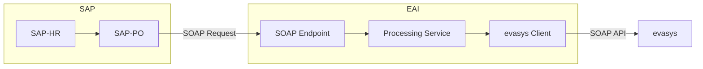
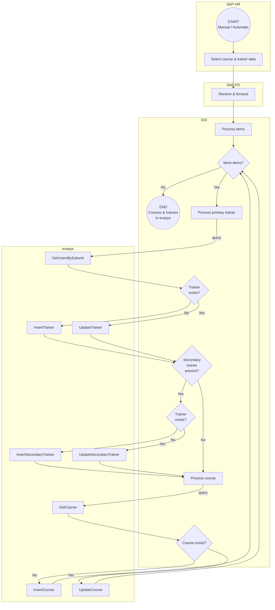

# Architecture

This document describes the architecture and data flow of the evasys EAI integration.

## System Overview

The evasys EAI acts as a middleware component between SAP Process Orchestration (SAP-PO) and evasys. It exposes a SOAP web service endpoint that receives training data from SAP-PO and uses the evasys SOAP API to synchronize trainers and courses.



## Component Architecture

### Package Structure

```
de.muenchen.evasys
├── Application.java        # Spring Boot application entry point
├── client/                 # evasys SOAP client
│   ├── EvasysClient.java
│   └── SoapHeaderHandler.java
├── configuration/          # Spring configuration
│   ├── EvasysClientConfiguration.java
│   ├── EvasysProperties.java
│   ├── NotificationProperties.java
│   ├── SapPoProperties.java
│   └── WebServiceConfiguration.java
├── endpoint/               # SOAP endpoint
│   └── SapServiceEndpoint.java
├── exception/              # Custom exceptions
│   └── EvasysException.java
├── mapper/                 # Data mapping
│   └── SapEvasysMapper.java
├── model/                  # Domain models
│   └── SecondaryTrainer.java
└── service/                # Business logic
    ├── EvasysService.java
    ├── MailNotificationService.java
    └── TrainingProcessorService.java
```

### Component Responsibilities

| Component | Responsibility |
|-----------|----------------|
| `SapServiceEndpoint` | Receives SOAP requests from SAP-PO |
| `TrainingProcessorService` | Orchestrates the synchronization workflow |
| `EvasysService` | Provides high-level operations for trainer and course management |
| `EvasysClient` | Low-level SOAP client for evasys API communication |
| `SapEvasysMapper` | Maps SAP data structures to evasys formats |
| `MailNotificationService` | Sends error notification emails |

## Data Flow

The following diagram shows the complete data flow when a training request is received:




## Data Mapping

Data transformation between SAP and evasys formats is handled by `SapEvasysMapper`, a [MapStruct](https://mapstruct.org/) interface that generates type-safe mapping code at compile time.

The mapper provides three main transformations:

- **Trainer mapping**: Converts SAP trainer fields to evasys `User` objects
- **Secondary trainer mapping**: Handles additional trainers associated with a course
- **Course mapping**: Transforms SAP training data to evasys `Course` objects, including custom fields stored as JSON

To modify or extend the mappings, update the `@Mapping` annotations in `SapEvasysMapper.java`. MapStruct will regenerate the implementation during the next build.

## WSDL Interfaces

The application uses two WSDL definitions:

1. **SI_Training_AS_IB.wsdl**: Defines the inbound interface for receiving data from SAP-PO
2. **evasys-soapserver-v100.wsdl**: Defines the evasys SOAP API for outbound calls

Both WSDLs are located in `src/main/resources/wsdl/` and Java classes are generated at build time using the CXF codegen plugin.
